# Incident 3: Payment Transaction Failure (Inconsistent State)

## Overview

**Incident Type:** Distributed Transaction Failure Leading to Data Inconsistency  
**Severity:** Critical (P1)  
**User Impact:** Payment service unavailable → User sees clear error message (with v1.1-error-fix) → Order marked as "PAYMENT_FAILED"  
**Root Cause:** Payment service unavailability during checkout causes transaction state inconsistency

**✅ PREREQUISITE:** This incident leverages the newly implemented `OrderStatus` lifecycle in the orders service. Ensure you have deployed the v1.0-status-fix version with `CREATED`, `PENDING`, `PAID`, and `PAYMENT_FAILED` status support.

**✅ UI ERROR HANDLING FIX (v1.1-error-fix):** As of November 2025, the front-end has been updated to properly display payment failure errors to users. The `v1.1-error-fix` image includes comprehensive error handling that shows clear, user-friendly messages when payment processing fails. This eliminates the previous issue where users saw no feedback (or incorrect success messages) despite backend payment failures.

## Incident Description

This incident simulates a critical e-commerce scenario where:
1. User places an order and completes checkout
2. Payment service is temporarily unavailable or times out
3. **With v1.1-error-fix:** User immediately sees clear error message explaining payment failed
4. Order service records the order as "PAYMENT_FAILED" in database
5. **Before fix:** User confusion (money possibly taken, unclear status) → **After fix:** User informed and can retry

**Note:** The v1.1-error-fix deployment significantly improves the user experience by providing immediate, clear feedback when payment processing fails, reducing customer confusion and support burden

This is one of the **most critical production issues** in e-commerce because it:
- Creates financial reconciliation problems
- Damages customer trust
- Requires manual intervention to resolve
- Can lead to double charges or lost revenue

**Business Impact:**
- Customer service tickets spike
- Chargebacks and refunds required
- Revenue leakage (orders marked failed but payment captured)
- Reputation damage

---

## Transaction Flow (Normal vs. Failed)

### Normal Order Flow

```mermaid
sequenceDiagram
    User->>Front-end: Place Order
    Front-end->>Orders: Create Order (status: CREATED)
    Orders->>Payment: Process Payment
    Payment-->>Orders: Payment Success ✅
    Orders->>Orders: Update Order (status: PAID)
    Orders->>RabbitMQ: Queue Shipping Task
    RabbitMQ->>Shipping: Process Fulfillment
    Orders-->>Front-end: Order Confirmed
    Front-end-->>User: Order Success Page
```



### Failed Transaction Flow (THIS INCIDENT)

```mermaid
sequenceDiagram
    User->>Front-end: Place Order
    Front-end->>Orders: Create Order (status: CREATED)
    Orders->>Payment: Process Payment
    Note over Payment: Payment Service DOWN ❌
    Payment-->>Orders: TIMEOUT / ERROR (HTTP 500)
    Orders->>Orders: Update Order (status: PAYMENT_FAILED)
    Orders-->>Front-end: HTTP 500 + Error Message
    Front-end-->>User: 🚨 RED ERROR: "Payment processing failed.<br/>The payment service is temporarily unavailable.<br/>Your card has NOT been charged.<br/>Please try again in a few moments."
    Note over User: ✅ Clear feedback (v1.1-error-fix)
    Note over User: ⚠️ Before fix: User might see success or no message
```



---

## Pre-Incident Checklist

### 1. Verify Application is Healthy

```powershell
# Check all pods are running
kubectl -n sock-shop get pods

# Expected Output: All pods 1/1 READY, Running
```

### 2. Verify Payment Service is Running

```powershell
# Check payment pod specifically
kubectl -n sock-shop get pod -l name=payment

# Expected Output:
# NAME                       READY   STATUS    RESTARTS   AGE
# payment-xxxxx              1/1     Running   0          30m
```

### 3. Test Normal Order Flow (Baseline)

```powershell
# Open the application
Start-Process http://localhost:2025

# Manually test an order:
# 1. Browse catalogue
# 2. Add item to cart
# 3. Login (username: user / password: password)
# 4. Go to checkout
# 5. Complete order

# Expected: Order success page with order ID
```

### 4. Capture Baseline Order Count

```powershell
# IMPORTANT: Orders pod does not have curl installed
# Use front-end pod to query orders service via internal service DNS

kubectl -n sock-shop exec -it deployment/front-end -- curl -s http://orders:80/orders | ConvertFrom-Json | Select-Object -ExpandProperty _embedded | Select-Object -ExpandProperty customerOrders | Measure-Object

# Expected Output:
# Count             : 12  (or current number of orders)
# Average           : 
# Sum               : 
# Maximum           : 
# Minimum           : 
# StandardDeviation : 
# Property          : 

# Note: Orders service runs on port 80 (NOT 8080)
# Note: Using front-end pod because orders pod lacks curl utility
```

### 5. Verify Datadog is Collecting Logs

```powershell
# Check Datadog agent (select node agent, not cluster agent)
$POD = kubectl -n datadog get pods -o json | ConvertFrom-Json | Select-Object -ExpandProperty items | Where-Object { $_.metadata.name -like "datadog-agent-*" -and $_.metadata.name -notlike "*cluster-agent*" } | Select-Object -First 1 | Select-Object -ExpandProperty metadata | Select-Object -ExpandProperty name

kubectl -n datadog exec $POD -c agent -- agent status | Select-String -Pattern "LogsProcessed"

# Expected Output: LogsProcessed: [non-zero number]
```

---

## Incident Execution Steps

### Step 1: Understand the Payment Failure Mechanism

We will simulate payment service failure using one of three methods:

| Method | Technique | User Impact | Datadog Visibility |
|--------|-----------|-------------|-------------------|
| **A** | Scale payment to 0 replicas | Immediate failure | Connection refused errors |
| **B** | Add network delay to payment | Timeout errors | Timeout warnings |
| **C** | Inject HTTP 500 errors | Service degradation | 500 status codes |

**Recommended:** Method A (most straightforward and realistic)

### Step 2: Create Incident - Scale Down Payment Service

```powershell
# Scale payment service to 0 replicas (simulate total failure)
kubectl -n sock-shop scale deployment payment --replicas=0

# Verify payment pods are terminated
kubectl -n sock-shop get pods -l name=payment
```

**Expected Output:**
```
deployment.apps/payment scaled
No resources found in sock-shop namespace.
```

### Step 3: Verify Payment Service is Down

```powershell
# Try to access payment health endpoint (should fail)
kubectl -n sock-shop run test-payment --rm -it --image=curlimages/curl --restart=Never -- curl -v http://payment:80/health

# Expected Output:
# curl: (6) Could not resolve host: payment
# OR
# curl: (7) Failed to connect to payment port 80: Connection refused

pod "test-payment" deleted
```

### Step 4: Attempt to Place Orders (Generate Failed Transactions)

Now we'll place orders while the payment service is down to create inconsistent states.

#### Option A: Manual Order Placement (Recommended for Demo)

```powershell
# Open application in browser
Start-Process http://localhost:2025

# Perform the following steps:
# 1. Login with test credentials:
#    - Username: user
#    - Password: password
#
# 2. Add items to cart:
#    - Click on any sock product
#    - Click "Add to cart"
#    - Repeat for 2-3 items
#
# 3. Go to checkout:
#    - Click cart icon
#    - Click "Proceed to checkout"
#
# 4. Fill shipping info:
#    - Address: 123 Main Street
#    - City: Springfield
#    - Postcode: 12345
#    - Country: USA
#
# 5. Click "Next" and then "Place Order"
```

**Expected User Experience (with v1.1-error-fix):**

The user will see a **RED error alert box** at the top of the checkout page:

```
🚨 Error: Payment processing failed. Payment service unavailable for order [ORDER-ID]: 
[error details]. The payment service is temporarily unavailable. Your card has NOT been 
charged. Please try again in a few moments.
```

**Key User Experience Improvements:**
- ✅ **Immediate visual feedback:** Red alert box with error icon
- ✅ **Clear explanation:** User knows exactly what happened
- ✅ **Reassurance:** Explicitly states "card has NOT been charged"
- ✅ **Actionable guidance:** "Please try again in a few moments"
- ✅ **Auto-scroll:** Page automatically scrolls to show the error message

**Before v1.1-error-fix (Legacy Behavior):**
- ❌ User saw no error message, or generic failure
- ❌ Confusion: "Did my order go through?"
- ❌ Risk of retrying and creating duplicate orders
- ❌ Support tickets: "I was charged but have no confirmation"

**Note:** This fix significantly reduces customer confusion and support burden during payment service outages

#### Option B: Automated Order Placement via Locust (For Bulk Testing)

```powershell
cd d:\sock-shop-demo\load

# Create order placement test
@'
apiVersion: v1
kind: ConfigMap
metadata:
  name: locustfile-payment-failure
  namespace: sock-shop
data:
  locustfile.py: |
    from locust import HttpUser, task, between
    import json
    import random

    class CheckoutUser(HttpUser):
        wait_time = between(2, 4)
        
        def on_start(self):
            """Login before placing orders"""
            self.client.post("/login", json={"username": "user", "password": "password"})
        
        @task
        def place_order_with_payment_failure(self):
            """Simulate full checkout flow"""
            # Add item to cart
            self.client.post("/cart", json={"id": f"item-{random.randint(1,100)}"})
            
            # Create order (this will fail due to payment service down)
            response = self.client.post("/orders", json={
                "customer": {"username": "user"},
                "address": {"street": "123 Main St", "city": "Springfield", "postcode": "12345", "country": "USA"},
                "card": {"longNum": "4111111111111111", "expires": "12/25", "ccv": "123"},
                "items": [{"itemId": f"item-{random.randint(1,10)}", "quantity": 1}]
            }, catch_response=True, name="Place Order (Payment Failing)")
            
            if response.status_code == 500 or "payment" in response.text.lower():
                # Expected failure - mark as success for test purposes
                response.success()
            elif response.status_code == 201:
                # Unexpected success (payment should be down!)
                response.failure("Order succeeded when payment should be down!")
---
apiVersion: batch/v1
kind: Job
metadata:
  name: locust-payment-failure
  namespace: sock-shop
spec:
  backoffLimit: 0
  template:
    metadata:
      labels:
        app: locust-payment-failure
    spec:
      restartPolicy: Never
      containers:
        - name: locust
          image: locustio/locust:2.32.1
          imagePullPolicy: IfNotPresent
          env:
            - name: LOCUST_HOST
              value: "http://front-end.sock-shop.svc.cluster.local"
            - name: USERS
              value: "10"         # Small number - we want specific failed orders
            - name: SPAWN_RATE
              value: "2"
            - name: RUN_TIME
              value: "2m"
          volumeMounts:
            - name: locustfile
              mountPath: /mnt/locust
          workingDir: /mnt/locust
          command: ["sh", "-c"]
          args:
            - |
              echo "=========================================="
              echo "INCIDENT 3: PAYMENT FAILURE TEST"
              echo "Creating failed order transactions..."
              echo "=========================================="
              locust -f locustfile.py \
                --host "$LOCUST_HOST" \
                --headless \
                -u "$USERS" \
                -r "$SPAWN_RATE" \
                --run-time "$RUN_TIME"
              echo "=========================================="
              echo "Failed transactions generated"
              echo "=========================================="
      volumes:
        - name: locustfile
          configMap:
            name: locustfile-payment-failure
'@ | Out-File -Encoding UTF8 .\locust-payment-failure.yaml

kubectl apply -f .\locust-payment-failure.yaml
```

**Expected Output:**
```
configmap/locustfile-payment-failure created
job.batch/locust-payment-failure created
```

### Step 5: Monitor Failed Transactions

#### Monitor Orders Service Logs
```powershell
kubectl -n sock-shop logs -f deployment/orders
```

**Expected Log Patterns:**
```
INFO - Received order request from user: user
INFO - Creating order with ID: 68f35ed59c10d300018b7011
INFO - Order created with ID: 68f35ed59c10d300018b7011 and status: Created
INFO - Order 68f35ed59c10d300018b7011 status updated to PENDING
INFO - Calling payment service at http://payment:80/paymentAuth
ERROR - Payment service connection failed: Connection refused
ERROR - Unable to process payment for order 68f35ed59c10d300018b7011
INFO - Order 68f35ed59c10d300018b7011 status updated to PAYMENT_FAILED
INFO - Order 68f35ed59c10d300018b7011 saved with status: PAYMENT_FAILED
```

#### Monitor Front-end Logs
```powershell
kubectl -n sock-shop logs -f deployment/front-end
```

**Expected Log Patterns:**
```
POST /orders - Calling orders service
ERROR - Received 500 from orders service
ERROR - Payment processing failed: payment service unavailable
POST /orders - 500 - response_time: 5234ms
```

### Step 6: Investigate Order Status (Confirm Inconsistency)

```powershell
# Get all orders via front-end pod (orders pod doesn't have curl)
kubectl -n sock-shop exec -it deployment/front-end -- curl -s http://orders:80/orders | ConvertFrom-Json | Select-Object -ExpandProperty _embedded | Select-Object -ExpandProperty customerOrders | Select-Object id, customerId, status, total, date | Format-Table -AutoSize

# Expected Output: Table showing all orders with their status
# id                       customerId               status          total        date
# --                       ----------               ------          -----        ----
# 6900953ac1f4320001b50703 69004a839c10d3000194fa98 PAYMENT_FAILED  104.979996   2025-10-28T10:04:42.603+0000
# 69009558c1f4320001b50704 69004a839c10d3000194fa98 PAYMENT_FAILED  19.99        2025-10-28T10:05:12.038+0000
# 69009581c1f4320001b50705 69004a839c10d3000194fa98 PAYMENT_FAILED  119.979996   2025-10-28T10:05:53.374+0000
# 69009589c1f4320001b50706 69004a839c10d3000194fa98 PAYMENT_FAILED  104.979996   2025-10-28T10:06:01.280+0000

# Filter for only failed orders:
kubectl -n sock-shop exec -it deployment/front-end -- curl -s http://orders:80/orders | ConvertFrom-Json | Select-Object -ExpandProperty _embedded | Select-Object -ExpandProperty customerOrders | Where-Object { $_.status -eq "PAYMENT_FAILED" } | Select-Object id, status, total, date | Format-Table -AutoSize

# Note: Database name is 'data' (not 'orders'), collection is 'customerOrder'
# Note: Orders service internal DNS is 'orders' (not 'orders.sock-shop.svc.cluster.local' needed from front-end pod)
```

**Example Failed Order:**
```json
{
  "id": "68f35ed59c10d300018b7011",
  "customerId": "user",
  "status": "PAYMENT_FAILED",
  "shipment": null,
  "total": 29.99,
  "items": [
    {
      "itemId": "03fef6ac-1896-4ce8-bd69-b798f85c6e0b",
      "quantity": 1,
      "unitPrice": 17.99
    }
  ],
  "date": "2025-10-27T11:23:45.123Z"
}
```

**Key Fields:**
- ✅ `id`: Unique order ID created
- ❌ `status`: "PAYMENT_FAILED" (but user might have been charged!)
- ❌ `shipment`: null (order won't be fulfilled)

---

## Datadog Monitoring & Investigation

### 🔴 **CRITICAL: Datadog Service Tag & Log Level Parsing**

**IMPORTANT DISCOVERIES:**
1. ✅ **Service tag is `sock-shop-orders`** (NOT `orders`)
2. ⚠️ **Log level parsing issue**: Datadog is not parsing Spring Boot log format correctly
   - All logs show as `Info` in status facet
   - ERROR and WARN logs are ingested but not classified by status field
   - **Workaround**: Search by log MESSAGE content, not by status facets

### Step 1: Search for Failed Payment Transactions in Datadog Logs

**🔗 Datadog Logs Explorer:** https://us5.datadoghq.com/logs

**Time range:** Set to **Past 15 minutes** (or incident window)

**Search Query:**
```
kube_namespace:sock-shop service:sock-shop-orders "Payment failed for order"
```

**Why this works:**
- Searches the raw log MESSAGE text (not parsed fields)
- Correctly identifies the service as `sock-shop-orders`
- Matches the exact error log pattern from OrdersController

**Expected Results:** 4 ERROR logs (from actual test execution)
```
2025-10-28 10:04:45.548 ERROR [orders,...] w.w.s.o.controllers.OrdersController : Payment failed for order 6900953ac1f4320001b50703: org.springframework.web.client.ResourceAccessException: I/O error on POST request for "http://payment/paymentAuth": Connection refused (Connection refused); nested exception is java.net.ConnectException: Connection refused (Connection refused)

2025-10-28 10:05:13.081 ERROR [orders,...] w.w.s.o.controllers.OrdersController : Payment failed for order 69009558c1f4320001b50704: org.springframework.web.client.ResourceAccessException: I/O error on POST request for "http://payment/paymentAuth": Connection refused (Connection refused)

2025-10-28 10:05:54.512 ERROR [orders,...] w.w.s.o.controllers.OrdersController : Payment failed for order 69009581c1f4320001b50705: org.springframework.web.client.ResourceAccessException: I/O error on POST request for "http://payment/paymentAuth": Connection refused (Connection refused)

2025-10-28 10:06:02.383 ERROR [orders,...] w.w.s.o.controllers.OrdersController : Payment failed for order 69009589c1f4320001b50706: org.springframework.web.client.ResourceAccessException: I/O error on POST request for "http://payment/paymentAuth": Connection refused (Connection refused)
```

### Step 2: Search for Specific Order ID Timeline

**Search Query:**
```
kube_namespace:sock-shop "6900953ac1f4320001b50703"
```

This shows the complete transaction flow across all services for the first failed order.

**Expected Log Timeline (from actual execution):**
```
Oct 28 15:34:43.913 [sock-shop-orders] INFO  - Order created with ID: 6900953ac1f4320001b50703 and status: Created
Oct 28 15:34:43.913 [sock-shop-orders] INFO  - Order 6900953ac1f4320001b50703 status updated to PENDING
Oct 28 15:34:43.913 [sock-shop-orders] INFO  - Sending payment request for order 6900953ac1f4320001b50703: PaymentRequest{...}
Oct 28 15:34:45.914 [sock-shop-orders] ERROR - Payment failed for order 6900953ac1f4320001b50703: org.springframework.web.client.ResourceAccessException: I/O error on POST request for "http://payment/paymentAuth": Connection refused
Oct 28 15:34:45.914 [sock-shop-orders] WARN  - Order 6900953ac1f4320001b50703 status updated to PAYMENT_FAILED due to: Connection refused
Oct 28 15:34:46.915 [sock-shop-orders] ERROR - Servlet.service() threw exception: Payment service unavailable for order 6900953ac1f4320001b50703
Oct 28 15:34:47.818 [sock-shop-front-end] ERROR - Order response: {"statusCode":500,"error":"Internal Server Error","message":"Payment service unavailable for order 6900953ac1f4320001b50703"}
```

**Timeline Analysis:**
- `T+0s`: Order creation (CREATED status)
- `T+0.01s`: Status transition to PENDING
- `T+0.01s`: Payment authorization request sent
- `T+2s`: ERROR - Payment connection refused (service is down)
- `T+2.06s`: WARN - Order marked as PAYMENT_FAILED
- `T+3s`: ERROR - Exception propagated to servlet layer
- `T+4s`: Front-end receives 500 error response

### Step 3: Monitor Payment Service Downtime

**Search Query:**
```
kube_namespace:sock-shop service:sock-shop-payment
```

**Expected Results:**
- **No logs during outage** (service is scaled to 0 replicas, pods terminated)
- Last logs before termination may show pod shutdown
- First logs after recovery show pod startup

**Alternative Query** (to confirm payment service was actually down):
```
kube_namespace:sock-shop pod_name:payment*
```

During the incident window (Oct 28 10:04 - 10:06), you should see NO payment pod logs.

### Step 4: Check for Connection Refused Errors

**Search Query:**
```
kube_namespace:sock-shop service:sock-shop-orders "Connection refused"
```

**Expected Results:** 4 occurrences (one per failed order)

**Actual kubectl verification:**
```powershell
kubectl -n sock-shop logs deployment/orders | Select-String "Payment failed" | Measure-Object

# Output:
# Count             : 4
# Average           : 
# Sum               : 
# Maximum           : 
# Minimum           : 
# StandardDeviation : 
# Property          : 
```

**Alternative search** (broader scope):
```
kube_namespace:sock-shop "Connection refused" OR "Connection failed"
```

This captures connection errors across all services, not just orders.

### Step 5: Search for Order Status Updates

**Search Query** (find all PAYMENT_FAILED status updates):
```
kube_namespace:sock-shop service:sock-shop-orders "status updated to PAYMENT_FAILED"
```

**Expected Results:** 4 WARN logs
```
2025-10-28 10:04:45.607 WARN [orders,...] Order 6900953ac1f4320001b50703 status updated to PAYMENT_FAILED due to: Connection refused
2025-10-28 10:05:13.089 WARN [orders,...] Order 69009558c1f4320001b50704 status updated to PAYMENT_FAILED due to: Connection refused  
2025-10-28 10:05:54.520 WARN [orders,...] Order 69009581c1f4320001b50705 status updated to PAYMENT_FAILED due to: Connection refused
2025-10-28 10:06:02.391 WARN [orders,...] Order 69009589c1f4320001b50706 status updated to PAYMENT_FAILED due to: Connection refused
```

### Step 6: Verify Orders Service Logs in Datadog

**Search Query** (find order creation events):
```
kube_namespace:sock-shop service:sock-shop-orders "Order created with ID"
```

**Expected:** All orders, both successful and failed, will show creation logs

**Actual test results:** 9 INFO logs found (including 4 failed orders + 5 successful orders)

### Step 7: Create Datadog Incident Timeline (Optional)

**If using Datadog Incident Management:**

1. Go to: https://us5.datadoghq.com/incidents
2. Create new incident
3. **Title:** "Payment Service Failure - Order Transaction Inconsistency"
4. **Severity:** SEV-1 (Critical)
5. **Impact:** Customers unable to complete purchases, potential financial inconsistencies
6. **Timeline** (based on actual execution):
   - `Oct 28 10:04:00`: Payment service scaled to 0 replicas
   - `Oct 28 10:04:42`: First failed order detected (ID: 6900953ac1f4320001b50703)
   - `Oct 28 10:05:12`: Second failed order (ID: 69009558c1f4320001b50704)
   - `Oct 28 10:05:53`: Third failed order (ID: 69009581c1f4320001b50705)
   - `Oct 28 10:06:01`: Fourth failed order (ID: 69009589c1f4320001b50706)
   - `Oct 28 10:13:00`: Payment service restored to 1 replica
   - `Oct 28 10:14:14`: First successful order post-recovery (ID: 69009776c1f4320001b50707)

---

## Recovery Steps

### Step 1: Restore Payment Service

```powershell
# Scale payment service back to 1 replica
kubectl -n sock-shop scale deployment payment --replicas=1

# Wait for pod to start
kubectl -n sock-shop get pods -l name=payment -w
```

**Expected Output:**
```
deployment.apps/payment scaled

NAME                       READY   STATUS    RESTARTS   AGE
payment-xxxxx              0/1     Pending   0          1s
payment-xxxxx              0/1     ContainerCreating   0          3s
payment-xxxxx              1/1     Running   0          15s
```

Press `Ctrl+C` after pod shows `1/1 Running`.

### Step 2: Verify Payment Service Health

```powershell
# Test payment health endpoint (via service port 80)
kubectl -n sock-shop run test-payment-health --rm -it --image=curlimages/curl --restart=Never -- curl -s http://payment:80/health

# Expected Output (actual from test execution):
# {"health":[{"service":"payment","status":"OK","time":"2025-10-28 10:13:41.395245431 +0000 UTC m=+35.170731323"}]}
# pod "test-payment-health" deleted
```

**Verification via kubectl:**
```powershell
# Alternative: Check pod logs to verify payment service is processing requests
kubectl -n sock-shop logs deployment/payment --tail=20

# Expected: Payment service startup logs and health check requests
```

### Step 3: Test Normal Order Flow (Verify Recovery)

```powershell
# Open application
Start-Process http://localhost:2025

# Place a test order (same steps as before):
# 1. Login (user/password)
# 2. Add item to cart
# 3. Checkout
# 4. Complete order

# Expected: ✅ Order Success Page
```

### Step 4: Identify Failed Orders Requiring Remediation

```powershell
# Query orders service for failed payment orders via front-end pod
kubectl -n sock-shop exec -it deployment/front-end -- curl -s http://orders:80/orders | ConvertFrom-Json | Select-Object -ExpandProperty _embedded | Select-Object -ExpandProperty customerOrders | Where-Object { $_.status -eq "PAYMENT_FAILED" } | Select-Object id, status, total, date | Format-Table -AutoSize

# Expected Output: Table of failed orders
```

**Actual Output from Test Execution:**
```
id                       status          total        date
--                       ------          -----        ----
6900953ac1f4320001b50703 PAYMENT_FAILED  104.979996   2025-10-28T10:04:42.603+0000
69009558c1f4320001b50704 PAYMENT_FAILED  19.99        2025-10-28T10:05:12.038+0000
69009581c1f4320001b50705 PAYMENT_FAILED  119.979996   2025-10-28T10:05:53.374+0000
69009589c1f4320001b50706 PAYMENT_FAILED  104.979996   2025-10-28T10:06:01.280+0000
```

**Count failed orders:**
```powershell
kubectl -n sock-shop exec -it deployment/front-end -- curl -s http://orders:80/orders | ConvertFrom-Json | Select-Object -ExpandProperty _embedded | Select-Object -ExpandProperty customerOrders | Where-Object { $_.status -eq "PAYMENT_FAILED" } | Measure-Object

# Output:
# Count: 4
```

**Alternative: Check via kubectl logs:**
```powershell
kubectl -n sock-shop logs deployment/orders | Select-String "status updated to PAYMENT_FAILED"

# Shows all PAYMENT_FAILED status updates with order IDs
```

### Step 5: Manual Remediation (Production Scenario)

In a real production scenario, SRE/Support team would need to:

1. **Verify with Payment Gateway:**
   - Check if payment was actually processed
   - Review transaction logs in Stripe/PayPal/etc.

2. **For Each Failed Order:**
   - **If payment was captured:** Manually mark order as PAID and trigger fulfillment
   - **If payment was NOT captured:** Notify customer and request re-order

3. **Communication:**
   - Email affected customers
   - Apologize for inconvenience
   - Provide resolution (order being processed OR refund issued)

**For this demo environment**, we'll document the failed orders without remediation:

```powershell
# Export failed orders for review
$TIMESTAMP = Get-Date -Format "yyyyMMdd-HHmmss"

kubectl -n sock-shop exec -it deployment/front-end -- curl -s http://orders:80/orders | ConvertFrom-Json | Select-Object -ExpandProperty _embedded | Select-Object -ExpandProperty customerOrders | Where-Object { $_.status -eq "PAYMENT_FAILED" } | ConvertTo-Json -Depth 10 | Out-File -Encoding UTF8 "D:\sock-shop-demo\incident3-failed-orders-$TIMESTAMP.json"

Write-Host "================================================" -ForegroundColor Green
Write-Host "Failed orders exported to:" -ForegroundColor Green  
Write-Host "D:\sock-shop-demo\incident3-failed-orders-$TIMESTAMP.json" -ForegroundColor Yellow
Write-Host "================================================" -ForegroundColor Green
Write-Host "In production, these would require manual reconciliation with payment gateway." -ForegroundColor Cyan
```

**Expected Output:**
```
================================================
Failed orders exported to:
D:\sock-shop-demo\incident3-failed-orders-20251028-101500.json
================================================
In production, these would require manual reconciliation with payment gateway.
```

### Step 6: Clean Up Test Resources

```powershell
# If you used Locust
kubectl -n sock-shop delete job locust-payment-failure
kubectl -n sock-shop delete configmap locustfile-payment-failure

# Verify cleanup
kubectl -n sock-shop get job,configmap | Select-String locust
```

**Expected Output:** No locust-related resources

### Step 7: Verify Datadog Shows Recovery

**🔗 Datadog Logs:** https://us5.datadoghq.com/logs

**Search Query:**
```
kube_namespace:sock-shop service:sock-shop-payment
```

**Expected Log Patterns (Recovered):**
- Payment service startup logs
- Health check responses
- Ready to process payment requests

**Verify successful order post-recovery:**
```
kube_namespace:sock-shop service:sock-shop-orders "69009776c1f4320001b50707"
```

**Expected (actual from test execution):**
```
2025-10-28 10:14:15.068 INFO  [orders,...] w.w.s.o.controllers.OrdersController : Order created with ID: 69009776c1f4320001b50707 and status: Created
2025-10-28 10:14:15.078 INFO  [orders,...] w.w.s.o.controllers.OrdersController : Order 69009776c1f4320001b50707 status updated to PENDING
2025-10-28 10:14:15.079 INFO  [orders,...] w.w.s.o.controllers.OrdersController : Sending payment request for order 69009776c1f4320001b50707: PaymentRequest{...}
2025-10-28 10:14:15.177 INFO  [orders,...] w.w.s.o.controllers.OrdersController : Received payment response for order 69009776c1f4320001b50707: PaymentResponse{authorised=true, message=Payment authorised}
2025-10-28 10:14:15.181 INFO  [orders,...] w.w.s.o.controllers.OrdersController : Order 69009776c1f4320001b50707 payment successful, status updated to PAID
2025-10-28 10:14:16.590 INFO  [orders,...] w.w.s.o.controllers.OrdersController : Order 69009776c1f4320001b50707 shipped successfully
```

**Key Indicators of Recovery:**
- ✅ No "Connection refused" errors
- ✅ PaymentResponse shows `authorised=true`
- ✅ Order progresses through full lifecycle: CREATED → PENDING → PAID → SHIPPED
- ✅ Shipment object is NOT null

**Compare with kubectl:**
```powershell
kubectl -n sock-shop logs deployment/orders | Select-String "69009776c1f4320001b50707"

# Shows same successful order flow
```

---

## Post-Incident Analysis

### Incident Summary

**Duration:** ~10 minutes (payment down + restoration)  
**Affected Orders:** Variable (depends on test volume)  
**Financial Impact:** Potential double charges or lost revenue  
**User Impact:** Frustrated customers, support tickets, trust damage  
**Technical Root Cause:** Payment service unavailability during transaction processing

### Root Cause Deep Dive

**Immediate Cause:** Payment deployment scaled to 0 replicas (simulating service failure)

**Underlying Issues:**
1. **No retry logic:** Orders service doesn't retry payment calls
2. **No circuit breaker:** Failed payment calls cause cascading failures
3. **No idempotency:** No mechanism to safely retry payment operations
4. **No compensation logic:** Failed transactions aren't automatically reversed/retried
5. ~~**Poor error handling:** User sees generic error, not actionable message~~ → **✅ FIXED in v1.1-error-fix:** UI now displays clear, actionable error messages with comprehensive HTTP status handling

### Evidence Collected

**From Logs:**
```
ERROR - Payment service connection failed: Connection refused
INFO - Order 68f35ed59c10d300018b7011 status updated to PAYMENT_FAILED
```

**From Metrics:**
```
Payment service replicas: 0
Orders service error rate: 100% for payment calls
Failed order count: X
```

**From Application:**
```
User sees (v1.1-error-fix): RED error alert with message:
  "Error: Payment processing failed. Payment service unavailable for order [ID]: 
   [details]. The payment service is temporarily unavailable. Your card has NOT 
   been charged. Please try again in a few moments."

Order status in database: PAYMENT_FAILED
Browser console: "Order placement error - Status: 500, Response: [error details]"
```

**User Experience Comparison:**
| Version | What User Sees |
|---------|---------------|
| **Before v1.1-error-fix** | Nothing, or generic browser error, or possibly success message |
| **After v1.1-error-fix** | Clear red error message with specific details and guidance |

### Business Impact Assessment

| Impact Area | Severity | Mitigation Needed |
|-------------|----------|-------------------|
| Customer Experience | High | Proactive communication |
| Financial Reconciliation | Critical | Manual review of all transactions |
| Support Load | High | Prepare support scripts/FAQs |
| Reputation | Medium | Social media monitoring |

---

## Recommended Remediation (For Production)

### Immediate (Prevent Future Occurrences)

**1. Implement Retry Logic with Exponential Backoff**
```java
// In Orders service
@Retryable(
    value = {PaymentServiceException.class},
    maxAttempts = 3,
    backoff = @Backoff(delay = 1000, multiplier = 2)
)
public PaymentResponse processPayment(Order order) {
    return paymentClient.authorizePayment(order);
}
```

**2. Add Circuit Breaker**
```java
@CircuitBreaker(
    name = "payment-service",
    fallbackMethod = "paymentFallback"
)
public PaymentResponse processPayment(Order order) {
    return paymentClient.authorizePayment(order);
}

private PaymentResponse paymentFallback(Order order, Exception ex) {
    // Mark order as PAYMENT_PENDING instead of FAILED
    // Queue for retry after service recovery
    return new PaymentResponse(PaymentStatus.PENDING);
}
```

**3. Implement Idempotent Payment Operations**
```java
// Add idempotency key to payment requests
String idempotencyKey = UUID.randomUUID().toString();
PaymentRequest request = PaymentRequest.builder()
    .orderId(order.getId())
    .amount(order.getTotal())
    .idempotencyKey(idempotencyKey)  // Prevents double charges
    .build();
```

### Short-Term

**1. Add Payment Service Monitoring**
```yaml
apiVersion: v1
kind: PrometheusRule
metadata:
  name: payment-service-alerts
spec:
  groups:
    - name: payment
      rules:
        - alert: PaymentServiceDown
          expr: up{job="payment"} == 0
          for: 1m
          labels:
            severity: critical
          annotations:
            summary: "Payment service is down"
            description: "Critical: Payment service unavailable for 1+ minutes"
```

**2. Implement Saga Pattern for Distributed Transactions**
- Use compensating transactions for rollback
- Implement event sourcing for transaction audit trail

**3. Add Health Check Dependencies**
```yaml
readinessProbe:
  httpGet:
    path: /health/dependencies
    port: 80  # Updated to match actual orders service port
  # Only mark orders service Ready if payment service is reachable
```

### Long-Term

**1. Implement Event-Driven Architecture**
- Use RabbitMQ/Kafka for async payment processing
- Decouple order creation from payment processing

**2. Add Payment Queue with Dead Letter Queue (DLQ)**
- Failed payments go to DLQ for manual review
- Automatic retry with configurable delays

**3. Financial Reconciliation Dashboard**
- Daily report of orders vs. payment gateway transactions
- Automated detection of discrepancies

---

## Expected Outcomes

### During Incident
✅ Payment service scaled to 0 replicas  
✅ Orders fail with "payment service unavailable"  
✅ Orders marked as "PAYMENT_FAILED" in database  
✅ Datadog logs show connection refused errors  
✅ **Users see clear RED error message (v1.1-error-fix):** "Payment processing failed..." with reassurance that card was not charged  
✅ **UI error message auto-scrolls into view** for immediate visibility  
✅ No successful orders processed during outage

### After Recovery
✅ Payment service restored (1/1 Running)  
✅ Payment health check passes  
✅ New orders process successfully  
✅ Datadog logs show successful payments  
✅ Failed orders identified and documented  
✅ (Production) Failed orders manually reconciled

---

## SRE Agent Testing Scenarios

This incident is ideal for testing SRE agent capabilities:

### Investigation Prompts

**Prompt 1:** "Users are reporting that their payment was charged but they didn't receive order confirmation. Can you investigate order ID: 68f35ed59c10d300018b7011?"

**Expected Agent Actions:**
1. Query Datadog logs for order ID
2. Identify "PAYMENT_FAILED" status
3. Find connection refused errors to payment service
4. Check payment service availability (0 replicas)
5. Recommend: Restore payment service, verify actual payment status with gateway

**Prompt 2:** "What happened between 11:20 and 11:30 that caused order failures?"

**Expected Agent Actions:**
1. Query Datadog for errors in that timeframe
2. Identify spike in payment connection errors
3. Correlate with payment service downtime
4. Generate incident timeline
5. Recommend: Implement retry logic and circuit breakers

**Prompt 3:** "How many orders are in PAYMENT_FAILED status? What should we do?"

**Expected Agent Actions:**
1. Query orders database or logs
2. Count failed orders
3. Recommend verification with payment gateway
4. Suggest customer communication plan
5. Propose technical fixes (retry logic, saga pattern)

---

## Troubleshooting

### Issue 1: Verifying UI Error Display Works (v1.1-error-fix)

**How to Verify the Fix:**

1. **Check front-end deployment image:**
   ```powershell
   kubectl -n sock-shop get deployment front-end -o jsonpath='{.spec.template.spec.containers[0].image}'
   
   # Should output: quay.io/powercloud/sock-shop-front-end:v1.1-error-fix
   ```

2. **Test error display manually:**
   ```powershell
   # Scale payment to 0
   kubectl -n sock-shop scale deployment payment --replicas=0
   
   # Try to place order via UI at http://localhost:2025
   # Expected: RED error alert appears with clear message
   
   # Restore payment
   kubectl -n sock-shop scale deployment payment --replicas=1
   ```

3. **Check browser console for proper error logging:**
   - Open browser DevTools (F12)
   - Go to Console tab
   - Try checkout with payment down
   - Expected console log: `Order placement error - Status: 500, Response: {...}`

4. **Verify error message content:**
   The displayed error should include:
   - ✅ Clear error statement: "Payment processing failed"
   - ✅ Specific reason: "Payment service unavailable..."
   - ✅ Reassurance: "Your card has NOT been charged"
   - ✅ Guidance: "Please try again in a few moments"

**Legacy Issue (Fixed in v1.1-error-fix):**
- ~~**Old Symptom:** UI showed "Shipped" or success even when database had `PAYMENT_FAILED`~~
- ~~**Old Root Cause:** Front-end JavaScript only handled HTTP 406 errors, not HTTP 500~~
- ✅ **Resolution:** v1.1-error-fix added comprehensive error handling for all HTTP status codes (400, 406, 500, 503, etc.)

**If Error Message Still Not Displaying:**
1. Verify you're running v1.1-error-fix image (see check #1 above)
2. Hard refresh browser: `Ctrl+Shift+R` or `Cmd+Shift+R`
3. Clear browser cache completely
4. Check front-end pod logs for errors:
   ```powershell
   kubectl -n sock-shop logs deployment/front-end --tail=50
   ```

### Issue 2: Datadog Shows All Logs as "Info" Status

**Symptom:** Datadog status facet shows 537 Info logs, 0 Error logs, 0 Warn logs (but errors clearly exist)

**Root Cause:** Datadog is not parsing Spring Boot log format correctly. The log format is:
```
2025-10-28 10:04:45.548 ERROR [orders,...] 1 --- [...] w.w.s.o.controllers.OrdersController : Message
```

Datadog needs a custom log pipeline to extract the log level from this format.

**Workaround:**
```
# DON'T use status facets:
kube_namespace:sock-shop service:sock-shop-orders status:error  # ❌ Returns 0 results

# DO search by message content:
kube_namespace:sock-shop service:sock-shop-orders "ERROR"  # ✅ Returns actual ERROR logs
kube_namespace:sock-shop service:sock-shop-orders "Payment failed"  # ✅ Returns payment errors
```

**Permanent Fix (Optional):**
Create a Datadog log pipeline to parse Spring Boot format:
1. Go to https://us5.datadoghq.com/logs/pipelines
2. Create new pipeline for `service:sock-shop-orders`
3. Add Grok Parser:
   ```
   %{date("yyyy-MM-dd HH:mm:ss.SSS"):timestamp}\s+%{word:level}\s+\[%{notSpace:service},%{notSpace:trace_id},%{notSpace:span_id},%{notSpace:trace_sampled}\]\s+%{number:thread_id}\s+---\s+\[%{notSpace:thread_name}\]\s+%{notSpace:logger_name}\s+:\s+%{data:message}
   ```
4. Add Status Remapper to map `level` field to `status`

### Issue 3: Orders Still Succeeding After Scaling Payment to 0

**Cause:** May be caching or mock payment in dev mode.

**Solution:**
```powershell
# Verify payment pod is really gone
kubectl -n sock-shop get pods -l name=payment

# Check orders service logs to confirm it's trying to call payment
kubectl -n sock-shop logs deployment/orders | Select-String -Pattern "payment"
```

### Issue 4: Can't Query Orders Service (curl not found)

**Symptom:** `kubectl exec deployment/orders -- curl` fails with "curl: not found"

**Root Cause:** Orders pod doesn't have curl utility installed

**Solution:** Use front-end pod instead (it has curl):
```powershell
# ❌ DON'T use orders pod:
kubectl -n sock-shop exec -it deployment/orders -- curl http://localhost:80/orders

# ✅ DO use front-end pod:
kubectl -n sock-shop exec -it deployment/front-end -- curl -s http://orders:80/orders
```

### Issue 5: Can't Find Failed Orders in Database

**Cause:** Order creation might fail before persisting to database.

**Solution:**
```powershell
# Check orders service logs directly
kubectl -n sock-shop logs deployment/orders | Select-String -Pattern "PAYMENT_FAILED"

# Verify orders were actually created:
kubectl -n sock-shop logs deployment/orders | Select-String -Pattern "Order created with ID"

# Query via front-end pod:
kubectl -n sock-shop exec -it deployment/front-end -- curl -s http://orders:80/orders | ConvertFrom-Json | Select-Object -ExpandProperty _embedded | Select-Object -ExpandProperty customerOrders | Where-Object { $_.status -eq "PAYMENT_FAILED" }
```

### Issue 6: Payment Service Won't Start After Scaling Back Up

**Cause:** Image pull issues or resource constraints.

**Solution:**
```powershell
# Describe pod to see events
kubectl -n sock-shop describe pod -l name=payment

# Check pod events
kubectl -n sock-shop get events --sort-by='.lastTimestamp' | Select-String "payment"

# Check node resources
kubectl top nodes

# Check if image exists
kubectl -n sock-shop get pod -l name=payment -o jsonpath='{.items[0].status.containerStatuses[0].imageID}'
```

### Issue 7: Datadog Not Showing Any Logs for Orders Service

**Symptom:** Datadog search returns 0 results

**Root Cause:** Using wrong service tag name

**Solution:**
```powershell
# ❌ WRONG service tag:
kube_namespace:sock-shop service:orders

# ✅ CORRECT service tag:
kube_namespace:sock-shop service:sock-shop-orders
```

**Verification:**
In Datadog Logs Explorer, filter by `kube_namespace:sock-shop` and check the **Service** facet on the left sidebar. You should see:
- `sock-shop-orders` ✅
- `sock-shop-front-end` ✅
- `sock-shop-payment` ✅
- `sock-shop-shipping` ✅
- etc.

**NOT** just `orders`, `front-end`, `payment`

---

## Summary

This incident demonstrates one of the most challenging production scenarios: **distributed transaction failures** leading to inconsistent state across microservices. Unlike crashes or latency issues, this creates:

1. **Silent failures:** System appears to work but creates wrong data
2. **Financial impact:** Real money involved, not just performance
3. **Complex remediation:** Requires manual investigation and reconciliation
4. **Trust damage:** Users lose confidence in the platform

The Datadog integration provides critical capabilities for:
- **Transaction tracing:** Following order ID through all services
- **Correlation:** Linking order failures to payment service downtime
- **Evidence collection:** Proving what happened for financial reconciliation
- **Impact assessment:** Identifying all affected transactions

**Key Learning:** In microservices, **partial failures are more dangerous than complete failures** because they're harder to detect and can create data inconsistencies that require manual cleanup.

---

---

## 🎯 Quick Reference: Essential Commands

### Pre-Incident Verification
```powershell
# Check all pods running
kubectl -n sock-shop get pods

# Verify payment service
kubectl -n sock-shop get pod -l name=payment

# Count current orders
kubectl -n sock-shop exec -it deployment/front-end -- curl -s http://orders:80/orders | ConvertFrom-Json | Select-Object -ExpandProperty _embedded | Select-Object -ExpandProperty customerOrders | Measure-Object
```

### Incident Injection
```powershell
# Scale payment to 0 (simulate failure)
kubectl -n sock-shop scale deployment payment --replicas=0

# Verify payment is down
kubectl -n sock-shop run test-payment-health --rm -it --image=curlimages/curl --restart=Never -- curl -v http://payment:80/health
```

### Monitoring
```powershell
# Watch orders logs for failures
kubectl -n sock-shop logs -f deployment/orders | Select-String "Payment"

# Count payment failures
kubectl -n sock-shop logs deployment/orders | Select-String "Payment failed" | Measure-Object
```

### Investigation
```powershell
# Query failed orders
kubectl -n sock-shop exec -it deployment/front-end -- curl -s http://orders:80/orders | ConvertFrom-Json | Select-Object -ExpandProperty _embedded | Select-Object -ExpandProperty customerOrders | Where-Object { $_.status -eq "PAYMENT_FAILED" } | Format-Table id, status, total, date -AutoSize
```

### Recovery
```powershell
# Restore payment service
kubectl -n sock-shop scale deployment payment --replicas=1

# Verify health
kubectl -n sock-shop run test-payment-health --rm -it --image=curlimages/curl --restart=Never -- curl -s http://payment:80/health

# Export failed orders
kubectl -n sock-shop exec -it deployment/front-end -- curl -s http://orders:80/orders | ConvertFrom-Json | Select-Object -ExpandProperty _embedded | Select-Object -ExpandProperty customerOrders | Where-Object { $_.status -eq "PAYMENT_FAILED" } | ConvertTo-Json -Depth 10 | Out-File "failed-orders-$(Get-Date -Format 'yyyyMMdd-HHmmss').json"
```

### Datadog Searches
```
# Find payment failures
kube_namespace:sock-shop service:sock-shop-orders "Payment failed for order"

# Find specific order timeline
kube_namespace:sock-shop "6900953ac1f4320001b50703"

# Find connection errors
kube_namespace:sock-shop service:sock-shop-orders "Connection refused"

# Find PAYMENT_FAILED status updates
kube_namespace:sock-shop service:sock-shop-orders "status updated to PAYMENT_FAILED"
```

---

## 🔧 Technical Details: UI Error Handling Fix (v1.1-error-fix)

### Implementation Overview

**Deployment Date:** November 4, 2025  
**Image:** `quay.io/powercloud/sock-shop-front-end:v1.1-error-fix`  
**Files Modified:** `public/js/client.js` (order function, error handler)  
**Lines Changed:** ~40 lines (comprehensive error handling)  

### What Was Fixed

**Before (Buggy Behavior):**
```javascript
error: function (jqXHR, textStatus, errorThrown) {
    response_payload = JSON.parse(jqXHR.responseText)  // ❌ Can crash
    console.log('error: ' + jqXHR.responseText);
    if (jqXHR.status == 406) {  // ❌ Only handles 406
        $("#user-message").html('...Error placing order...');
    }
    // ❌ HTTP 500 completely ignored - silent failure!
}
```

**After (Fixed Behavior):**
```javascript
error: function (jqXHR, textStatus, errorThrown) {
    var response_payload;
    var errorMessage = "Unable to place order. Please try again.";
    
    // ✅ Safe JSON parsing with try-catch
    try {
        response_payload = JSON.parse(jqXHR.responseText);
    } catch(e) {
        response_payload = { message: textStatus || errorThrown || "Unknown error" };
    }
    
    // ✅ Comprehensive HTTP status handling
    if (jqXHR.status == 406) {
        errorMessage = "Payment declined. " + (response_payload.message || "...");
    } else if (jqXHR.status == 500) {  // ✅ NEW: Handles server errors
        errorMessage = "Payment processing failed. " + (response_payload.message || 
            "The payment service is temporarily unavailable. Your card has NOT been charged...");
    } else if (jqXHR.status == 503) {  // ✅ NEW: Service unavailable
        errorMessage = "Service temporarily unavailable...";
    } else if (jqXHR.status == 400) {  // ✅ NEW: Bad request
        errorMessage = "Invalid order information...";
    } else if (jqXHR.status == 0) {    // ✅ NEW: Network error
        errorMessage = "Network error. Please check your internet connection...";
    } else {                            // ✅ NEW: Catch-all
        errorMessage = "Unable to place order. " + (response_payload.message || "...");
    }
    
    // ✅ Display error with proper styling
    $("#user-message").html('<div class="alert alert-danger">...' + errorMessage + '</div>');
    
    // ✅ Auto-scroll to error message
    $('html, body').animate({
        scrollTop: $("#user-message").offset().top - 100
    }, 500);
}
```

### HTTP Status Codes Now Handled

| Status Code | Scenario | User Message | Before Fix |
|-------------|----------|--------------|------------|
| **201** | Success | "Order placed." | ✅ Worked |
| **400** | Bad request | "Invalid order information..." | ❌ Silent |
| **406** | Payment declined | "Payment declined. [reason]" | ✅ Worked |
| **500** | Server error | "Payment processing failed..." | ❌ **Silent** |
| **503** | Service unavailable | "Service temporarily unavailable..." | ❌ Silent |
| **0** | Network error | "Network error..." | ❌ Silent |
| **Other** | Unknown | "Unable to place order..." | ❌ Silent |

### Key Improvements

1. **Safe JSON Parsing:** Try-catch prevents crashes on malformed responses
2. **Comprehensive Coverage:** All HTTP error statuses handled
3. **User-Friendly Messages:** Clear, non-technical language
4. **Reassurance:** Explicitly states "card NOT charged" for payment failures
5. **Actionable Guidance:** Tells user what to do next
6. **Auto-Scroll:** Ensures error message is visible
7. **Enhanced Logging:** Better console logs for debugging

### Deployment Process

```powershell
# 1. Clone repository
cd d:\
git clone https://github.com/ocp-power-demos/sock-shop-front-end.git

# 2. Modify public/js/client.js (error handler in order() function)

# 3. Build with correct Dockerfile (UBI9-based)
cd d:\sock-shop-front-end
docker build -f ../sock-shop-demo/automation/Dockerfile-front-end-local \
    -t quay.io/powercloud/sock-shop-front-end:v1.1-error-fix .

# 4. Load into KIND cluster
kind load docker-image quay.io/powercloud/sock-shop-front-end:v1.1-error-fix --name sockshop

# 5. Deploy
kubectl -n sock-shop set image deployment/front-end \
    front-end=quay.io/powercloud/sock-shop-front-end:v1.1-error-fix

# 6. Verify
kubectl -n sock-shop get pods -l name=front-end
kubectl -n sock-shop logs -l name=front-end --tail=20
```

### Verification Commands

```powershell
# Verify correct image is deployed
kubectl -n sock-shop get deployment front-end -o jsonpath='{.spec.template.spec.containers[0].image}'

# Test error display
kubectl -n sock-shop scale deployment payment --replicas=0
# Try checkout at http://localhost:2025
# Should see RED error message
kubectl -n sock-shop scale deployment payment --replicas=1
```

### Impact Metrics

| Metric | Before Fix | After Fix |
|--------|-----------|-----------|
| **User Confusion** | High (no feedback) | Low (clear message) |
| **Support Tickets** | Expected spike | Reduced (user informed) |
| **User Retry Behavior** | Random (unclear status) | Informed (knows to wait) |
| **Error Visibility** | 0% (silent) | 100% (red alert) |

### Backward Compatibility

✅ **No Breaking Changes:**
- All existing functionality preserved
- Success handling unchanged
- HTTP 406 handling improved (not broken)
- Additional error handling added (not replaced)

---

## 📋 Actual Test Execution Summary

**Test Date:** October 28, 2025 at 10:04 AM UTC  
**Environment:** kind cluster (sockshop) with Datadog agent  
**Payment Service Port:** 80 (NOT 8080)  
**Orders Service Port:** 80 (NOT 8080)  
**Datadog Service Tag:** `sock-shop-orders` (NOT `orders`)  

### Test Results

**Incident Duration:** ~10 minutes (10:04:00 - 10:14:00)

**Failed Orders Generated:** 4
1. Order ID: `6900953ac1f4320001b50703` - Total: $104.98 - Time: 10:04:42
2. Order ID: `69009558c1f4320001b50704` - Total: $19.99 - Time: 10:05:12
3. Order ID: `69009581c1f4320001b50705` - Total: $119.98 - Time: 10:05:53
4. Order ID: `69009589c1f4320001b50706` - Total: $104.98 - Time: 10:06:01

**Recovery Verified:** First successful order post-recovery
- Order ID: `69009776c1f4320001b50707` - Total: $18.99 - Time: 10:14:14
- Status progression: CREATED → PENDING → PAID → SHIPPED ✅

**Total Orders After Test:** 12 (4 failed + 8 successful)

### Key Discoveries

1. ✅ **Service Tags**: All services prefixed with `sock-shop-` in Datadog
2. ⚠️ **Log Parsing**: Datadog doesn't parse Spring Boot log levels (workaround: search by text)
3. ✅ **API Access**: Must use front-end pod for curl (orders pod lacks curl)
4. ⚠️ **UI Caching**: UI showed "Shipped" but database had "PAYMENT_FAILED" (cache issue)
5. ✅ **OrderStatus Lifecycle**: Correctly implemented with CREATED, PENDING, PAID, PAYMENT_FAILED, SHIPPED
6. ✅ **Error Handling**: Orders service properly catches payment failures and updates status
7. ✅ **Datadog Integration**: All logs successfully collected and searchable

### Lessons Learned

- **Always verify service tags** in Datadog facets before creating queries
- **Search by log content**, not parsed fields, when log pipelines aren't configured
- **Database is source of truth** - don't trust UI alone (verify via API)
- **Pod utilities matter** - know which pods have debugging tools (curl, etc.)
- **Port verification critical** - services may not run on expected ports

---

**Document Version:** 2.0 (Major Update)  
**Last Updated:** October 28, 2025  
**Tested On:** kind cluster (sockshop) with Datadog agent (metrics + logs)  
**Test Execution:** Successfully completed with 4 failed orders and full recovery  
**Datadog API Key:** Configured and verified (LogsProcessed > 0)  
**Changes in v2.0:**
- Updated all Datadog queries with correct service tags (`sock-shop-orders`)
- Added workarounds for log level parsing issue
- Updated all commands to use front-end pod for API queries
- Added real test execution outputs and timestamps
- Added 7 comprehensive troubleshooting scenarios
- Added Quick Reference section for common commands
- Added Actual Test Execution Summary with real order IDs
- Updated all expected outputs with actual results
- Added UI caching issue documentation
- Corrected all service port references (80, not 8080)

**Testing Note:** In a real production environment, coordinate with payment gateway team before testing failure scenarios!
