# Incident 5: Asynchronous Order Processing Failure (Queue Consumer Unavailable)

## Overview

**Incident Type:** Distributed System Async Processing Failure  
**Severity:** High (P2)  
**User Impact:** Orders complete successfully but shipments never processed → Silent business failure  
**Root Cause:** Queue consumer (queue-master) unavailable, breaking async message processing pipeline

---

## Incident Description

This incident simulates a critical but **silent** failure mode in distributed asynchronous systems where:

1. User places order and completes checkout ✅
2. Payment processed successfully ✅
3. Order marked as PAID in database ✅
4. **Shipping service publishes fulfillment message to RabbitMQ** ✅
5. **Queue-master consumer is DOWN** ❌
6. Messages accumulate in queue but are never processed ❌
7. **Orders paid but never shipped** ❌
8. **No user-facing error** - Silent failure ❌

This is one of the **most dangerous production issues** in microservices because:
- ✅ User sees "Order Successful" 
- ✅ Payment captured
- ❌ Fulfillment never happens
- ❌ No alerts to user
- ❌ Discovered only through customer complaints or batch reconciliation

**Business Impact:**
- Revenue loss (fulfilled orders without shipment tracking)
- Customer dissatisfaction (orders never arrive)
- Support ticket spike (where's my order?)
- Inventory discrepancies
- SLA violations

**Why This Is Dangerous:**
Unlike INCIDENT-1 (crash) or INCIDENT-3 (payment failure), this incident has:
- **No immediate user feedback** - User thinks order succeeded
- **No error in logs from user's perspective** - All frontend calls return 200 OK
- **Delayed discovery** - Hours or days before someone notices
- **Data consistency issue** - Order in DB shows PAID, but shipment record missing

---

## Architecture: Async Message Flow

### Normal Operation

```mermaid
sequenceDiagram
    participant User
    participant FE as Front-end
    participant Ord as Orders
    participant Pay as Payment
    participant Ship as Shipping
    participant RMQ as RabbitMQ
    participant QM as Queue-Master
    participant DB as Orders-DB

    User->>FE: Place Order
    FE->>Ord: POST /orders
    Ord->>Pay: POST /paymentAuth
    Pay-->>Ord: Payment Success
    Ord->>Ord: Update status=PAID
    Ord->>DB: Save Order
    Ord->>Ship: POST /shipping
    Ship->>RMQ: Publish message to 'shipping-task' queue
    Ship-->>Ord: Shipment Created
    Ord-->>FE: 201 Created
    FE-->>User: Order Successful! ✅
    
    Note over RMQ,QM: Async Processing
    RMQ->>QM: Deliver message
    QM->>QM: Process Fulfillment
    QM->>DB: Update Shipment Status
```



### Broken Flow (THIS INCIDENT)

```mermaid
sequenceDiagram
    participant User
    participant FE as Front-end
    participant Ord as Orders
    participant Pay as Payment
    participant Ship as Shipping
    participant RMQ as RabbitMQ
    participant QM as Queue-Master (DOWN)
    participant DB as Orders-DB

    User->>FE: Place Order
    FE->>Ord: POST /orders
    Ord->>Pay: POST /paymentAuth
    Pay-->>Ord: Payment Success
    Ord->>Ord: Update status=PAID
    Ord->>DB: Save Order
    Ord->>Ship: POST /shipping
    Ship->>RMQ: Publish message to 'shipping-task' queue
    Ship-->>Ord: Shipment Created
    Ord-->>FE: 201 Created
    FE-->>User: Order Successful! ✅
    
    Note over QM: Queue-Master scaled to 0
    Note over RMQ: Messages accumulate (not consumed)
    Note over QM: NO PROCESSING ❌
    Note over User: Thinks order is complete<br/>but shipment never processed
```



---

## Pre-Incident Checklist

### 1. Verify Application is Healthy

```powershell
# Check all pods are running
kubectl -n sock-shop get pods

# Expected output - all Running
# NAME                            READY   STATUS    RESTARTS   AGE
# queue-master-xxxxx              1/1     Running   0          10m  ← CRITICAL POD
# rabbitmq-xxxxx                  2/2     Running   0          10m  ← MESSAGE QUEUE
# shipping-xxxxx                  1/1     Running   0          10m  ← PUBLISHER
# (... other pods ...)
```

**Success Criteria:**
- ✅ All 14 pods in Running state
- ✅ queue-master pod exists (we'll break this)
- ✅ rabbitmq pod exists (message broker)
- ✅ shipping pod exists (message publisher)

---

### 2. Verify Datadog is Collecting Logs

```powershell
# Get Datadog agent pod (worker node agent)
$POD = kubectl -n datadog get pods -l app=datadog-agent -o jsonpath='{.items[0].metadata.name}'

# Check log collection status
kubectl -n datadog exec $POD -c agent -- agent status | Select-String -Pattern "LogsProcessed|LogsSent" -Context 0,2
```

**Expected Output:**
```
  LogsProcessed: 5000+
  LogsSent: 5000+
```

**✅ SUCCESS:** Logs flowing to Datadog  
**❌ FAIL:** Restart Datadog agent

---

### 3. Baseline: Verify Normal Async Processing

```powershell
# Check queue-master is consuming messages
kubectl -n sock-shop logs deployment/queue-master --tail=20
```

**Expected Logs:**
```
INFO  Consuming from queue: shipping-task
INFO  Message processed successfully
```

**This confirms queue-master is actively processing messages.**

---

## Triggering the Incident

### Step 1: Document Timestamp

```powershell
# Record exact start time
$INCIDENT_START = Get-Date -Format "yyyy-MM-ddTHH:mm:ss"
Write-Host "INCIDENT START: $INCIDENT_START"
```

---

### Step 2: Break the Queue Consumer

```powershell
# Scale queue-master to 0 replicas (stop consuming messages)
kubectl -n sock-shop scale deployment/queue-master --replicas=0

# Verify pod is gone
kubectl -n sock-shop get pods -l name=queue-master
```

**Expected Output:**
```
No resources found in sock-shop namespace.
```

**✅ SUCCESS:** Queue-master pod deleted

---

### Step 3: Create Test Orders

```powershell
# Ensure port-forward is active
kubectl port-forward -n sock-shop svc/front-end 2025:8079

# Open browser: http://localhost:2025
# Login: user / password
# Place 3-5 orders
```

**Expected:** Orders succeed! ✅ (But shipments won't process ❌)

---

## 📊 AI SRE Detection via Datadog

### Detection Query 1: Check Pod Status

**Datadog Infrastructure:**
```
Filter: kube_namespace:sock-shop kube_deployment:queue-master
Result: 🚨 No containers found
```

---

### Detection Query 2: Shipping Still Publishing

**Datadog Logs:**
```
Query: kube_namespace:sock-shop service:shipping "Published"
Result: ✅ Shipping service actively publishing messages
```

---

### Detection Query 3: Queue-Master NOT Consuming

**Datadog Logs:**
```
Query: kube_namespace:sock-shop service:queue-master
Result: 🚨 No logs for 15+ minutes
```

---

### Detection Query 4: Log Correlation

**Combined Query:**
```
kube_namespace:sock-shop (service:shipping OR service:queue-master)
```

**AI SRE Sees:**
```
Before incident: Both services logging
After incident: Only shipping logging ← ASYNC PIPELINE BROKEN
```

---

## Recovery Procedure

```powershell
# Scale queue-master back to 1
kubectl -n sock-shop scale deployment/queue-master --replicas=1

# Verify recovery
kubectl -n sock-shop logs deployment/queue-master --tail=50 -f
# Should see: "Consuming messages" and backlog processing
```

---

## Success Criteria

### ✅ Incident Triggered:
1. Queue-master scaled to 0
2. Orders still succeed (no user error)
3. Shipping logs show publishing
4. Queue-master logs absent
5. Datadog shows pod = 0 replicas

### ✅ Recovery Complete:
1. Queue-master back to 1 replica
2. Logs show consuming messages
3. Backlog processed

---

## Root Cause

**Primary:** Queue consumer (queue-master) scaled to 0

**Contributing Factors:**
1. Single consumer design (no redundancy)
2. No dead-letter queue
3. No consumer health monitoring
4. No user notification of async processing status

---

## AI SRE Testing Scenario

**Challenge:**
> "Orders placed in the last hour haven't shipped. Front-end shows orders succeeded. Investigate."

**Expected AI SRE Response:**
1. Check Datadog Infrastructure → queue-master = 0 replicas
2. Check Datadog Logs → shipping publishing, queue-master not consuming
3. Check Datadog Events → Deployment scaled to 0 at [timestamp]
4. **Root Cause:** Async consumer unavailable
5. **Recommendation:** Scale queue-master to 1 replica

---

**End of INCIDENT-5 Documentation**

**Version:** 1.0  
**Created:** November 5, 2025  
**Purpose:** AI SRE observability testing - Silent async failure detection
