# Incident 8: Database Performance Degradation (Catalogue Database Latency)

## Overview

**Incident Type:** Database Performance Degradation  
**Severity:** High (P2)  
**User Impact:** Product browsing slow or unavailable → Direct revenue loss  
**Root Cause:** Database resource exhaustion (CPU) causing query latency and connection timeouts

---

## Incident Description

This incident simulates a **database performance bottleneck** that cascades through the application tier:

1. Catalogue-db (MariaDB) resource exhaustion (CPU at 100%)
2. SQL queries take 3-5 seconds instead of <100ms
3. Catalogue service experiences database timeouts
4. Front-end product pages slow or fail to load
5. Users cannot browse products → Cannot purchase → Revenue loss

**Why This Is Critical:**
- **Core business function affected:** Product browsing (entry point for all purchases)
- **Silent degradation:** Database doesn't crash, just gets slower
- **Cascading failure:** DB → App → Frontend → User experience
- **Revenue impact:** Users leave site if products don't load within 3 seconds

**Real-World Scenario:**
This happens when:
- Database under-provisioned for traffic
- Inefficient queries (missing indexes, full table scans)
- Connection pool exhaustion
- Database maintenance operations (vacuum, reindex) running during peak hours
- Sudden traffic spike (flash sale, marketing campaign)

---

## Architecture: Database Tier

### Normal Operation

```mermaid
sequenceDiagram
    participant User
    participant FE as Front-end
    participant Cat as Catalogue
    participant DB as Catalogue-DB (MariaDB)

    User->>FE: Browse Products
    FE->>Cat: GET /catalogue
    Cat->>DB: SELECT * FROM sock
    Note over DB: Query executes in 50ms
    DB-->>Cat: Result set (200 OK)
    Cat-->>FE: JSON response (200 OK)
    FE-->>User: Products displayed ✅
```



### Degraded Performance (THIS INCIDENT)


---

## Pre-Incident Checklist

### 1. Verify Application is Healthy

```powershell
# Check catalogue and catalogue-db pods
kubectl -n sock-shop get pods -l name=catalogue
kubectl -n sock-shop get pods -l name=catalogue-db

# Expected: Both Running
```

---

### 2. Verify Datadog is Collecting Metrics

```powershell
# Check Datadog agent status
$POD = kubectl -n datadog get pods -l app=datadog-agent -o jsonpath='{.items[0].metadata.name}'
kubectl -n datadog exec $POD -c agent -- agent status | Select-String "kubernetes.cpu.usage"
```

**Expected:** Metric collection active

---

### 3. Baseline: Normal Product Browsing

```powershell
# Access front-end
kubectl port-forward -n sock-shop svc/front-end 2025:8079

# Open browser: http://localhost:2025
# Browse products - should load instantly (<1 second)
```

---

### 4. Check Current Database Resources

```powershell
# Check catalogue-db resource limits
kubectl -n sock-shop get deployment catalogue-db -o yaml | Select-String -Pattern "resources:" -Context 5
```

**Current State:** NO resource limits (resources: {})  
**This is perfect** - we'll add restrictive limits to trigger the incident

---

## Triggering the Incident

### Step 1: Document Timestamp

```powershell
$INCIDENT_START = Get-Date -Format "yyyy-MM-ddTHH:mm:ss"
Write-Host "INCIDENT START: $INCIDENT_START"
```

---

### Step 2: Apply Resource Constraints to Database

```powershell
# Severely limit catalogue-db CPU and memory
kubectl -n sock-shop set resources deployment/catalogue-db `
  --limits=cpu=50m,memory=128Mi `
  --requests=cpu=25m,memory=64Mi

# Verify new limits applied
kubectl -n sock-shop get deployment catalogue-db -o yaml | Select-String -Pattern "resources:" -Context 5
```

**Expected Output:**
```yaml
resources:
  limits:
    cpu: 50m        # Severely limited (was unlimited)
    memory: 128Mi   # Severely limited
  requests:
    cpu: 25m
    memory: 64Mi
```

**Wait for pod restart:**
```powershell
kubectl -n sock-shop rollout status deployment/catalogue-db
# Wait for: deployment "catalogue-db" successfully rolled out
```

---

### Step 3: Generate Database Load (Product Browsing)

**Option A: Manual Testing**

```powershell
# Ensure port-forward active
kubectl port-forward -n sock-shop svc/front-end 2025:8079

# Open browser: http://localhost:2025
# Rapidly browse products:
#   1. Click "All Products"
#   2. Refresh page multiple times (F5)
#   3. Navigate between pages
#   4. Search for products
#   5. View individual product details
```

**Expected User Experience:**
- ⏳ Page loads take 5-10 seconds (was <1 second)
- ❌ Some requests timeout (504 Gateway Timeout)
- ❌ "Error loading products" messages
- 🐌 Extremely slow browsing experience

---

**Option B: Automated Load Test** (Recommended for sustained load)

```powershell
# Create Locust test file
$LOCUST_FILE = @"
from locust import HttpUser, task, between
import random

class ProductBrowser(HttpUser):
    wait_time = between(0.5, 1.5)
    
    @task(5)
    def browse_products(self):
        # Browse all products (hits database heavily)
        response = self.client.get("/catalogue")
        if response.status_code != 200:
            print(f"Product listing failed: {response.status_code}")
    
    @task(2)
    def view_product(self):
        # View specific product
        product_ids = [
            "03fef6ac-1896-4ce8-bd69-b798f85c6e0b",
            "510a0d7e-8e83-4193-b483-e27e09ddc34d",
            "808a2de1-1aaa-4c25-a9b9-6612e8f29a38",
            "d3588630-ad8e-49df-bbd7-3167f7efb246",
            "a0a4f044-b040-410d-8ead-4de0446aec7e"
        ]
        product_id = random.choice(product_ids)
        response = self.client.get(f"/catalogue/{product_id}")
        if response.status_code != 200:
            print(f"Product detail failed: {response.status_code}")
    
    @task(1)
    def search_products(self):
        # Search products (triggers database query)
        search_terms = ["sock", "cat", "colour", "stripe"]
        term = random.choice(search_terms)
        response = self.client.get(f"/catalogue?tags={term}")
"@

Set-Content -Path "load\incident8_db_degradation.py" -Value $LOCUST_FILE

# Run load test (30 concurrent users for 3 minutes)
locust -f load/incident8_db_degradation.py `
  --host http://localhost:2025 `
  --users 30 `
  --spawn-rate 5 `
  --run-time 3m `
  --headless
```

**Expected Locust Output:**
```
Type     Name              # reqs  # fails  Avg    Min   Max    Median  req/s
GET      /catalogue        450     120      4500   200   8000   4200    2.5
GET      /catalogue/{id}   180     45       3200   150   6500   3000    1.0

Failures:
  - 504 Gateway Timeout (75 occurrences)
  - 500 Internal Server Error (90 occurrences)
```

---

### Step 4: Record End Timestamp

```powershell
$INCIDENT_END = Get-Date -Format "yyyy-MM-ddTHH:mm:ss"
Write-Host "INCIDENT END: $INCIDENT_END"
Write-Host "`nTime Range for Datadog: $INCIDENT_START to $INCIDENT_END"
```

---

## 📊 AI SRE Detection via Datadog

Your AI SRE will detect this through **multiple correlated signals**.

### Detection Query 1: Database CPU Spike

**Datadog Metrics Explorer:**
```
Metric: kubernetes.cpu.usage
Scope: kube_namespace:sock-shop, pod_name:catalogue-db*
```

**What AI SRE Sees:**
```
Graph showing:
Before incident: 10-20m (10-20% of limit)
During incident: 50m (100% of limit) ← CPU THROTTLED
Pattern: Sustained high CPU for 5+ minutes
```

**AI SRE Observation:**
> "catalogue-db CPU at 100% of limit (50m). Pod is CPU-throttled, causing query delays."

---

### Detection Query 2: Catalogue Service Errors

**Datadog Logs:**
```
Query: kube_namespace:sock-shop service:catalogue (error OR timeout OR slow OR failed)
```

**What AI SRE Sees:**
```
[timestamp] ERROR: Database query timeout after 5000ms
[timestamp] ERROR: dial tcp catalogue-db:3306: i/o timeout
[timestamp] WARN: Query execution time: 4523ms (threshold: 1000ms)
[timestamp] ERROR: Error 1040: Too many connections
[timestamp] ERROR: context deadline exceeded (database timeout)
```

**AI SRE Observation:**
> "Catalogue service experiencing database timeouts. Query latency increased from 50ms to 4500ms."

---

### Detection Query 3: Front-end Errors

**Datadog Logs:**
```
Query: kube_namespace:sock-shop service:front-end (catalogue OR 500 OR timeout)
```

**What AI SRE Sees:**
```
[timestamp] ERROR: GET /catalogue failed: 500 Internal Server Error
[timestamp] ERROR: Timeout calling catalogue service after 5000ms
[timestamp] WARN: Slow response from catalogue: 4850ms
[timestamp] ERROR: upstream request timeout (catalogue)
```

**AI SRE Observation:**
> "Front-end experiencing errors when calling catalogue service. User-facing product pages failing."

---

### Detection Query 4: Pod Resource Pressure

**Datadog Infrastructure:**
```
Filter: kube_namespace:sock-shop kube_deployment:catalogue-db
View: Container details
```

**What AI SRE Sees:**
```
Pod: catalogue-db-xxxxx
CPU: 50m / 50m (100% utilization) ← AT LIMIT
Memory: 115Mi / 128Mi (90% utilization)
Status: Running (but CPU-throttled)
Restarts: 0 (not crashing, just slow)
```

**AI SRE Observation:**
> "catalogue-db pod is CPU-throttled at 100% of its 50m limit. This is causing query delays."

---

### Detection Query 5: Log Correlation Timeline

**Combined Query:**
```
kube_namespace:sock-shop (service:catalogue-db OR service:catalogue OR service:front-end)
```

**What AI SRE Sees (Timeline):**
```
[Before incident]
10:55 catalogue: Query executed in 45ms ✅
10:56 front-end: Product page loaded successfully ✅
10:57 catalogue: Query executed in 52ms ✅

[Incident starts - resource limits applied]
11:00 catalogue-db: Pod restarted with new limits
11:01 catalogue: Query executed in 3200ms ⚠️
11:01 front-end: Slow response from catalogue: 3400ms ⚠️
11:02 catalogue: Database timeout after 5000ms ❌
11:02 front-end: Error 500 - catalogue service unavailable ❌
11:03 catalogue-db: CPU at 100% of limit 🚨
11:03 catalogue: Query executed in 4800ms ❌
11:03 front-end: Product page timeout ❌
```

**AI SRE Critical Insight:**
> "**DATABASE PERFORMANCE DEGRADATION DETECTED:**
> - Trigger: catalogue-db resource limits applied at 11:00
> - Impact: Query latency increased from 50ms to 4500ms (90x slowdown)
> - Cascade: DB slow → Catalogue timeouts → Front-end errors
> - User Impact: Product browsing unavailable/extremely slow
> - Root Cause: catalogue-db CPU throttled at 100% (50m limit too low)
> - Recommendation: Increase catalogue-db CPU limit to 200m+"

---

## Recovery Procedure

### Step 1: Increase Database Resources

```powershell
# Remove restrictive limits, set reasonable ones
kubectl -n sock-shop set resources deployment/catalogue-db `
  --limits=cpu=500m,memory=512Mi `
  --requests=cpu=100m,memory=128Mi

# Wait for rollout
kubectl -n sock-shop rollout status deployment/catalogue-db
```

**Expected:** Deployment rolled out successfully

---

### Step 2: Verify Database Performance Restored

```powershell
# Check catalogue-db CPU usage (should drop significantly)
kubectl top pod -n sock-shop -l name=catalogue-db
```

**Expected Output:**
```
NAME                          CPU(cores)  MEMORY(bytes)
catalogue-db-xxxxxxxxxx-xxx   45m         95Mi    ← CPU well below limit
```

---

### Step 3: Verify Application Recovery

```powershell
# Check catalogue service logs (should show normal query times)
kubectl -n sock-shop logs deployment/catalogue --tail=20 | Select-String "query|error|timeout"
```

**Expected:** No errors, normal query execution times

---

### Step 4: Test User Experience

```powershell
# Browse products
# Open: http://localhost:2025
# Expected: Products load instantly (<1 second)
```

---

## Success Criteria

### ✅ Incident Triggered:
1. catalogue-db CPU at 100% of limit (50m)
2. Catalogue service logs show timeouts/slow queries
3. Front-end logs show 500 errors calling catalogue
4. User experience: Slow or failing product pages
5. Datadog metrics show CPU spike

### ✅ Recovery Complete:
1. catalogue-db CPU below 80% of new limit
2. No timeout errors in catalogue logs
3. Front-end requests succeed (200 OK)
4. Product pages load in <1 second
5. Datadog metrics normalized

---

## Root Cause Analysis

### Primary Root Cause
**Database Under-Provisioned for Workload**

The catalogue-db was given a 50m CPU limit, which is insufficient for:
- Multiple concurrent queries
- Full table scans (no indexes)
- Product listing queries
- Search queries

**Normal Query:** 50ms  
**With 50m CPU limit:** 4500ms (90x slower)

---

### Contributing Factors

**1. No Query Optimization**
- Missing indexes on frequently queried columns
- Full table scans for product searches
- No query result caching

**2. Connection Pool Exhaustion**
- Limited connections to slow database
- Connections held longer due to slow queries
- New requests queue waiting for connections

**3. No Database Monitoring**
- No slow query logging
- No connection pool metrics
- No proactive alerting on query latency

**4. Resource Limits Too Low**
- 50m CPU insufficient for production workload
- No load testing performed before setting limits
- No auto-scaling for database tier

---

## AI SRE Testing Scenarios

### Scenario 1: Performance Degradation Detection

**Challenge:**
> "Users are complaining that product pages take 10+ seconds to load. Some requests timeout. Investigate."

**Expected AI SRE Response:**
1. Query Datadog for front-end errors → Find 500 errors calling catalogue
2. Query catalogue service logs → Find database timeouts
3. Check catalogue-db metrics → CPU at 100% of limit
4. Check timeline → Performance degraded after resource limit change
5. **Root Cause:** catalogue-db CPU throttled (50m limit too low)
6. **Impact:** 90x query slowdown (50ms → 4500ms)
7. **Recommendation:** Increase CPU limit to 500m

**Evaluation Criteria:**
- ✅ Traced error from user → front-end → catalogue → database
- ✅ Identified resource constraint as root cause
- ✅ Quantified performance impact (latency increase)
- ✅ Provided correct remediation

---

### Scenario 2: Cascading Failure Analysis

**Challenge:**
> "Multiple services are showing errors. Start with the root cause, not symptoms."

**Expected AI SRE Response:**
1. Query all service logs for errors
2. Find: front-end errors calling catalogue, catalogue errors calling DB
3. Trace dependency chain: DB → Catalogue → Front-end
4. Check DB metrics → CPU at 100%
5. **Root Cause:** Database performance bottleneck (lowest tier)
6. **Cascade:** Slow DB → Catalogue timeouts → Front-end errors
7. **Priority:** Fix database first, others will recover automatically

**Evaluation Criteria:**
- ✅ Identified lowest tier (database) as root cause
- ✅ Distinguished root cause from symptoms
- ✅ Understood cascading failure pattern
- ✅ Prioritized remediation correctly

---

### Scenario 3: Resource Constraint Identification

**Challenge:**
> "Why is catalogue-db slow despite being 'Running' with no crashes?"

**Expected AI SRE Response:**
1. Check pod status → Running (not crashed)
2. Check resource metrics → CPU at 100% of limit
3. Check resource limits → 50m CPU (very low)
4. **Insight:** Pod not crashed, but CPU-throttled
5. **Explanation:** CPU limit too low causes throttling, not crashes
6. **Remediation:** Increase CPU limit, not restart pod

**Evaluation Criteria:**
- ✅ Distinguished throttling from crashing
- ✅ Identified resource constraint correctly
- ✅ Understood Kubernetes resource limits behavior
- ✅ Recommended correct fix (not just restart)

---

## Troubleshooting

### Issue 1: Incident Not Severe Enough

**Symptoms:** Database slow but not timing out

**Fix:** Apply even lower limits
```powershell
kubectl -n sock-shop set resources deployment/catalogue-db `
  --limits=cpu=25m,memory=64Mi
```

---

### Issue 2: Database Pod CrashLooping

**Symptoms:** Pod keeps restarting

**Cause:** Memory limit too low (database can't start)

**Fix:** Increase memory slightly
```powershell
kubectl -n sock-shop set resources deployment/catalogue-db `
  --limits=cpu=50m,memory=256Mi
```

---

### Issue 3: Can't See CPU Metrics in Datadog

**Diagnosis:**
```powershell
# Check if metrics-server running
kubectl get deployment metrics-server -n kube-system
```

**Fix:**
```powershell
# If not found, cluster-agent should provide metrics
# Check Datadog cluster-agent status
kubectl -n datadog logs deployment/datadog-agent-cluster-agent --tail=50
```

---

## Technical Details

### Database Schema

**Table:** sock  
**Columns:** sock_id, name, description, price, count, image_url, tags

**Problematic Query (Full Table Scan):**
```sql
SELECT * FROM sock WHERE tags LIKE '%stripe%';
-- No index on tags → Full table scan → Slow with limited CPU
```

**DSN Connection String:**
```
root:admin@tcp(catalogue-db:3306)/socksdb
```

---

## Prevention Strategies

1. **Right-Size Resources:** Load test before setting limits
2. **Add Indexes:** Index frequently queried columns
3. **Query Caching:** Cache product listings (Redis)
4. **Connection Pooling:** Monitor and tune pool size
5. **Slow Query Logging:** Alert on queries >1000ms
6. **Auto-Scaling:** HPA for database replicas (read replicas)

---

**End of INCIDENT-8 Documentation**

**Version:** 1.0  
**Created:** November 5, 2025  
**Purpose:** AI SRE observability testing - Database performance degradation detection
